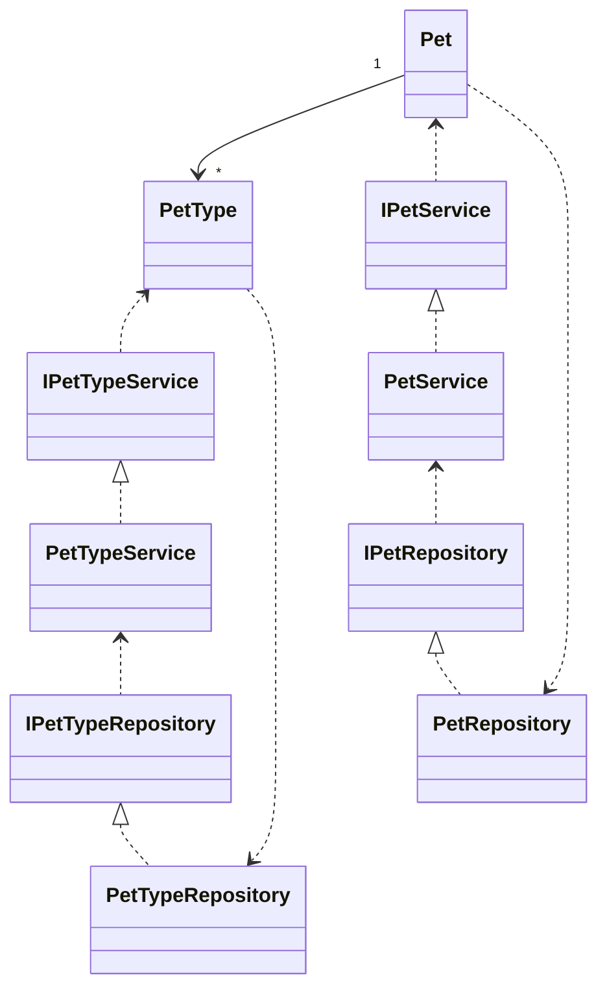
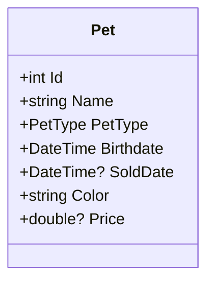
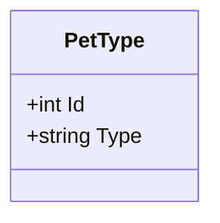
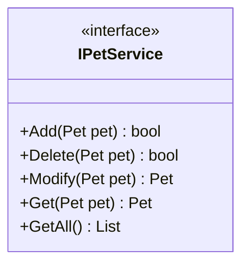
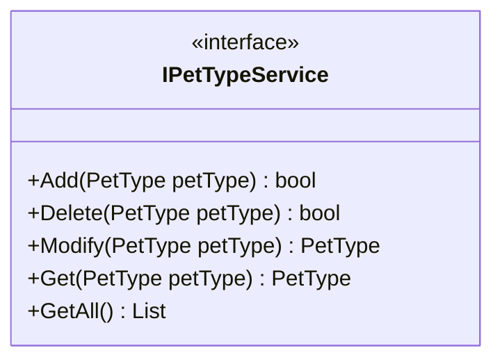
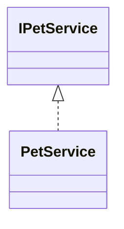
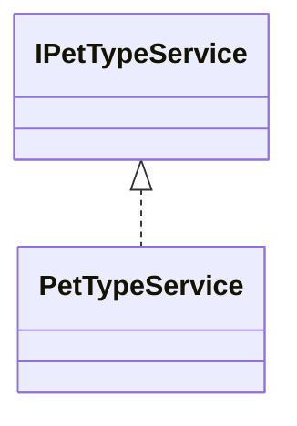
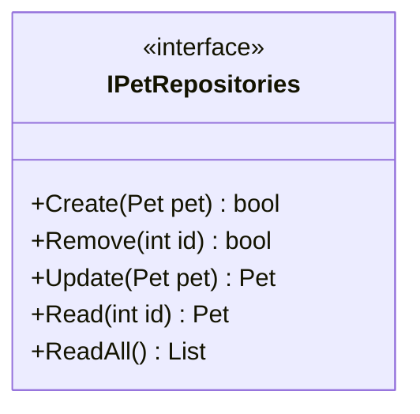
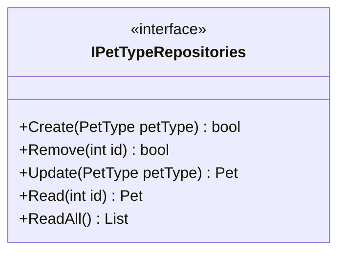

EASV.CS20s.Fei.Assignment.PetShop

This is the first compulsory assignment at 3rd semester EASV CS20s. 

## Vision

This application is a console application which is working for pet trade service. It should can manage the pet in the shop. Offer the pet trading service for the customer which is add, delete, update, search, sort the pet information. Offer the sales UI to customer to use the service. Offer the manage UI to control the pet in the shop. 

This application should based on the Onion architecture to organise the structure of code. Following the architecture it should easy to improve the application to add the different model and component. 

This application’s language is C# based on .NET Core.

## The Structure (Solution level)

### Core

#### Models

Pet

PetType

#### IService

IPetService

IPetTypeService

### Domain

#### Service

PetService

PetTypeService

#### IRepositories

IPetRepository

IPetTypeRepository

#### IUI

IMenuService

#### ITest

ITestService

### Infrastructure

#### Repository

PetRepository

PetTypeRepository

#### RepositoryService

PetRepositoryService

PetTypeRepository

### UI

#### Menu

#### MenuService

### Test 

Test

